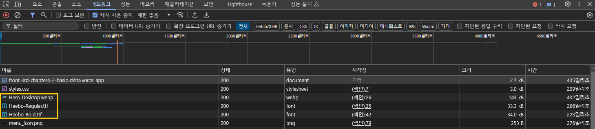
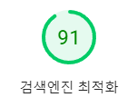

# Chapter 4-2 성능 최적화 - 바닐라 JS 프로젝트 성능 개선

- [도메인](https://front-3rd-chapter4-2-basic-delta.vercel.app/)

## 프로젝트 목적

- PageSpeed와 Lighthouse를 이용해서 페이지의 성능을 측정하고 Lighthouse 점수와 Core Web Vitals 지표를 중심으로 페이지의 성능을 개선했습니다.
- Lighthouse의 각 지표를 이해하고, 개선 방법에 대해서 학습했습니다.
- 커밋을 기준으로 개선된 부분을 전/후 비교를 통해 분석했습니다.

## 상세 개선 항목

### 0. 최초 측정 지표

|모바일 최초 지표|PC 최초 지표|
|---|---|
|||

### 1. LCP 개선

- `LCP`란?
	- 페이지의 주요 콘텐츠(시각적으로 큰 콘텐츠)가 표시되기까지 걸린 시간을 나타내는 지표입니다.
	- 뷰포트 내에서 이미지/비디오/텍스트 블록 중 시각적으로 가장 큰 사이즈를 차지하는 블록이 처음으로 브라우저에 paint 되기까지의 시간을 의미합니다.

- 개선이 필요한 이유
	- 이미지 파일의 용량이 너무 큰 탓에 초기 페이지 로딩이 오래걸렸습니다. 특히, 모바일에서 LCP가 16.6초로 매우 안좋은 성능이 측정되고 있었습니다.
	- 뷰포트에 노출되지 않은 이미지도 로드해서 불필요한 데이터 사용이 발생하고, 초기 페이지 로딩을 지연시키고 있었습니다.

#### 1.1 이미지 포맷을 WebP로 변환

- 개선 방법
	- jpg 형식의 이미지를 webp로 변환해서 이미지 파일의 크기를 줄였습니다.

- 개선 효과
	- 이미지 파일 크기가 감소해서 페이지 로딩 시간 감소하고, LCP가 개선됐습니다.

- 추가 개선 필요 사항
	- webp를 지원하지 않는 브라우저가 있어 fallback 이미지 제공 필요합니다.

<br>

|개선전 지표|개선후 지표|
|---|---|
|||

| 측정 지표 | 개선 전 | 개선 후 | 개선율 |
|---------|--------|--------|--------|
| LCP | 14.63s | 9.68s | 33.8% 감소 |

#### 1.2 이미지 압축

- 개선 이유
	- 이미지 포맷을 변환했지만 이미지 파일의 용량이 너무 큰 탓에 초기 페이지 로딩이 오래걸렸습니다.

- 개선 방법
	- 이미지 압축을 통해 추가적으로 파일 크기를 줄였습니다.
		-	[tinypng.com](https://tinypng.com)

- 개선 효과
	- 추가적으로 이미지 파일 크기를 더 줄일 수 있었고, 페이지 로딩 시간을 개선할 수 있었습니다.

<br>

|개선전 지표|개선전 이미지 크기|
|---|---|
|||

|개선후 지표|개선후 이미지 크기|
|---|---|
|||

| 측정 지표 | 개선 전 | 개선 후 | 개선율 |
|---------|--------|--------|--------|
| LCP | 9.68s | 4.13s | 57.3% 감소 |
| 이미지 파일 크기 | 1109KB | 284.3KB | 74.3% 감소 |

#### 1.3 히어로 이미지를 반응형 이미지로 변경

- 개선 이유
	- 화면에 노출되지 않는 히어로 이미지를 로드해서 불필요한 데이터 사용이 발생하고, 초기 페이지 로딩 시간이 길었습니다.

- 개선 방법
	- picture 태그를 이용해서 현재 뷰포트에 맞는 이미지만 로드하도록 개선했습니다.

<details>
	<summary>개선 코드</summary>

```html
<picture>
  <source media="(max-width: 575px)" srcset="images/Hero_Mobile.webp">
  <source media="(min-width: 576px) and (max-width: 960px)" srcset="images/Hero_Tablet.webp">
  
</picture>
```

</details>

<br>

- 개선 효과
	- 요청하는 파일 수가 감소해서 불필요한 데이터 사용량이 감소했고, 초기 페이지 로딩 시간이 감소했습니다.

<br>

|개선전 지표|개선전 불러오는 이미지 개수|
|---|---|
|||

|개선후 지표|개선후 불러오는 이미지 개수|
|---|---|
|||

| 측정 지표 | 개선 전 | 개선 후 | 개선율 |
|---------|--------|--------|--------|
| 데이터 전송량 | 2.1MB | 724KB | 65.5% 감소 |
| 이미지 요청 수 | 3 | 1 | 66.7% 감소 |

#### 1.4 히어로 이미지 preload

- 개선 이유
	- 히어로 이미지의 LCP 시간이 2.5초 이상 소요됐습니다.
	- 우선 순위가 높은 히어로 이미지를 `preload`해서 히어로 이미지가 화면에 표시되는 시간을 단축하고자 했습니다.

- 개선 방법
	- 히어로 이미지에 `preload` 적용해서 `LCP` 시간을 단축했습니다.
	- 현재 뷰포트에 맞는 히어로 이미지를 `preload`하기 위해 `link` 태그에 `media` 속성을 적용했습니다.

<details>
	<summary>개선 코드</summary>

```html
<link
	rel="preload"
	as="image"
	href="images/Hero_Mobile.webp"
	media="(max-width: 575px)"
>
<link
	rel="preload"
	as="image"
	href="images/Hero_Tablet.webp"
	media="(min-width: 576px) and (max-width: 960px)"
>
<link
  rel="preload"
  as="image"
  href="images/Hero_Desktop.webp"
  media="(min-width: 961px)"
>
```

</details>

<br>

|개선전 모바일 LCP 요소 렌더링|개선 전 PC LCP 요소 렌더링|
|---|---|
|||

|개선후 모바일 LCP 요소 렌더링|개선 후 PC LCP 요소 렌더링|
|---|---|
|||

|개선후 모바일 지표|개선후 PC 지표|
|---|---|
|||

| 측정 지표 | 개선 전 | 개선 후 | 개선율 |
|---|---|---|---|
| LCP (모바일) | 3.8s | 2.1s | 44.7% 감소 |
| LCP (데스크톱) | 2.9s | 1.8s | 37.9% 감소 |
| 초기 렌더링 시간 | 1.2s | 0.8s | 33.3% 감소 |

### 2. 렌더링 차단 리소스 제거

#### 2.1 외부 스크립트 지연 로딩

- 개선 이유
	- 외부 스크립트(cookie-consent)가 HTML 파싱을 중단시켜서 페이지의 렌더링을 지연시키고 있었습니다.
	- DOM 생성 이후에 실행되어도 되는 `cookieconsent` 관련 스크립트가 불필요하게 `head`에서 실행되고 있었습니다.

- 개선 방법
	- 브라우저는 `script` 태그를 만나면 HTML 파싱을 중단하고, `script`가 다운로드되고, 실행되는 것을 기다립니다. 이 때문에 페이지 렌더링 지연이 발생합니다.
	- HTML을 파싱하는 동안에 스크립트를 백그라운드에서 다운로드 할 수 있는 `defer` 속성을 적용했습니다.
	- `async`도 동일하게 HTML 파싱을 중단하지 않고, 스크립트를 다운로드 받을 수 있지만 스크립트의 실행 순서를 보장하고  `async` 대신 `defer`를 사용했습니다.
	- `cookieconsent.run`을 실행하는 코드를 body 태그로 이동했습니다. `cookie-consent.js` 스크립트는 다운로드된 이후 `DOMContentLoaded` 이벤트 발생 전에 실행되므로 기존 코드와 동일하게 실행 순서를 보장할 수 있습니다.

- 개선 효과
	- 렌더링 차단 리소스에서 `cookie-consent` 항목을 제거했습니다.
	- 그런데, FCP 개선은 안됐고, 오히려 `Total Blocking Time`이 260ms → 390ms로 증가했습니다.

<br>

|개선전 네트워크 탭|개선 후 네트워크 탭|
|---|---|
|||

| 측정 지표 | 개선 전 | 개선 후 | 개선율 |
|---------|--------|--------|------|
| Total Blocking Time | 260ms | 390ms | 50% 증가 |
| 렌더링 차단 리소스 수 | 2 | 1 | 50% 감소 |

#### 2.2 웹 폰트를 로컬 폰트로 변경

- 개선 이유
	- 구글 웹 폰트 CSS로 인해서 초기 페이지 렌더링이 지연되고 있었습니다.

- 개선 방법
	- 웹 폰트 대신 로컬 폰트(self-hosting font)를 적용해서 렌더링을 차단하지 않도록 수정했습니다.
	
- 개선 효과
	- FCP가 감소했습니다.
	- LCP가 감소했습니다.
	- TBT 시간이 오히려 증가했습니다.
	- 시스템 폰트가 렌더링됐다가 폰트가 로드된 이후 폰트가 적용되는 `FOUC` 이슈가 발생했습니다.

<br>

|개선전 네트워크 탭|개선 후 네트워크 탭|개선 후 지표|
|---|---|---|
||||

#### 2.3 FOUT 이슈 개선

- `FOUC`란?
	- 폰트가 로드되기 전에 시스템 폰트가 렌더링되는 이슈입니다.
	- 폰트가 로드되기 전에 테스트가 보이지 않는 `FOIT` 현상을 방지하기 위해서 `font-display: swap;`을 사용할 경우 `FOUC` 현상이 발생할 수 있습니다.

- 개선 이유
	- 폰트 로드가 완료되기 전에 시스템 폰트가 먼저 노출되어 사용자 경험을 떨어뜨릴 수 있습니다.

- 개선 방법
	- `preload`를 이용해 폰트를 우선 로드하고, 시스템 폰트가 렌더링되는 것을 방지합니다.

- 개선 효과
	- 폰트가 먼저 로드되어 `FOUT`를 발생하지 않았습니다.
	- 하지만, 히어로 이미지 `preload` 태그보다 폰트 `preload` 태그를 더 위에 둬서 `LCP`가 증가했습니다.

<br>

|개선 후 네트워크 탭|개선 후 지표|
|---|---|
|||

#### 2.4 히어로 이미지, 폰트 preload 순서 변경

- 개선 방법
	- 폰트 preload 보다 히어로 이미지 preload를 더 먼저할 수 있도록 preload 순서를 조정했습니다.
	- 모든 폰트를 preload하지 않고, 가장 많이 사용되는 400, 700 폰트만 preload하도록 변경했습니다.

- 개선 효과
	- 히어로 이미지가 먼저 로드되어 `LCP`가 개선되었습니다.

<br>

|개선 후 네트워크 탭|개선 후 지표|
|---|---|
|||

### 3. Total Blocking Time(TBT) 개선

- `TBT`란?
	- First Contentful Paint(FCP) 이후부터 Time to Interactive(TTI)까지의 구간에서 발생하는 긴 작업(Long Task)들의 차단 시간을 모두 더한 값입니다.
	- 여기서 "긴 작업"이란 50ms 이상 메인 스레드를 차단하는 작업을 의미하며, 각 작업의 차단 시간은 (실제 작업 시간 - 50ms)로 계산됩니다.

- TBT를 개선해야되는 이유
	- 브라우저의 메인 스레드가 javascript를 실행하느라 사용자의 클릭이나 스크롤 같은 입력을 즉시 처리하지 못할 수 있습니다.
	- 이는 결과적으로 페이지 이탈률을 증가시킬 수 있습니다.

- 기존 코드의 문제점
	- 기존 코드는 천만 건의 계산을 동기적으로 실행하기 때문에 메인 스레드가 차단됩니다.(블로킹)
	- 실행 시간을 측정했을 때 170ms ~ 260ms(최대)로 측정됐습니다.
	- 블로킹 상태에서는 다른 코드를 실행할 수 없고, 이벤트 리스너가 동작하지 않습니다.

<details>
	<summary>기존 코드</summary>

```js
const startTime = performance.now();

// Simulate heavy operation. It could be a complex price calculation.
for (let i = 0; i < 10000000; i++) {
    const temp = Math.sqrt(i) * Math.sqrt(i);
}

const endTime = performance.now();
console.log(`실행 시간: ${endTime - startTime}ms`);
```

</details>

<br>

- 개선 방법
	- 큰 작업을 작은 단위(청크)로 나누고, setTimeout을 이용해 각 청크를 비동기적으로 실행해서 메인 스레드의 차단을 최소화 했습니다.

- 개선 효과
	- 메인 스레드가 차단되는 시간이 줄어 사용자의 입력을 정상적으로 처리할 수 있습니다.

- 추가 개선 필요 사항
	- 적절한 청크 사이즈는 어떻게 설정할지 고민이 필요합니다.

<br>

|개선 전 모바일 지표|개선 전 PC 지표|개선 후 지표|
|---|---|---|
||||

| 환경 | 개선 전 | 개선 후 | 개선율 |
|---|---|---|---|
| 모바일 | 910ms | 90ms | 90.1% 감소 |
| PC | 180ms | 90ms | 50% 감소 |

### 4. CLS(Cumulative Layout Shift) 개선

- `CLS`란?
	- 페이지가 로드되는 동안 발생하는 예기치 않은 레이아웃 이동을 측정하는 지표입니다.

- CLS를 개선해야하는 이유
	- 예기치 않은 레이아웃 이동이 발생해서 사용자 경험을 해칠 수 있습니다.
	- 특히 모바일에서 사용자가 의도치 않게 잘못된 요소를 클릭할 수 있습니다.

- 기존 코드의 문제점
	- 이미지에 width, height가 지정되어 있지 않으면 브라우저는 이미지를 다운로드한 후 이미지의 크기를 알 수 있습니다.
	- 이미지의 크기를 알기 전엔 공간을 확보하지 않았기 때문에 이미지가 로드된 후 이미지가 들어갈 공간을 확보하게 되고, 이미지 아래에 있던 컨텐츠가 밀려나게됩니다.
	- 이러한 현상을 레이아웃 시프트(Layout Shift)라 하고, 콘텐츠가 이동한 거리와 영향을 받은 영역이 클수록 값이 누적되어 CLS 점수가 나빠지게 됩니다.(Cumulative는 누적이라는 뜻을 가지고 있습니다.)
	- 특히, 기존 코드는 히어로 이미지를 포함해서 모든 `img` 태그에 크기가 지정되어 있지 않았고, 레이아웃 시프트 현상이 발생하고 있었습니다.

- 개선 방법
	- 이미지에 `width` `height`를 설정해서 브라우저가 이미지 로딩 전에 이미지가 들어갈 공간을 확보할 수 있도록 설정합니다.
	- 이미지에 크기를 지정할 경우 브라우저가 이미지가 로드되는 동안 문서에 올바른 가로세로 비율의 공간을 할당할 수 있고, 레이아웃 시프트 현상을 방지할 수 있습니다.
	- css `aspect-ratio`를 이용해서 개선하는 방법도 있습니다.

<details>
	<summary>개선 코드</summary>

```html
<picture>
  <source width="575" height="575" media="(max-width: 575px)" srcset="images/Hero_Mobile.webp">
  <source width="960" height="770" media="(min-width: 576px) and (max-width: 960px)" srcset="images/Hero_Tablet.webp">
  
</picture>
```

```css
 /* 
	 💡 주의 이 속성이 없을 경우 img 태그에 지정한 width, height 그대로 렌더링될 수 있습니다.
 */
img {
	width: 100%;
	height: auto;
}

/* media desktop */
img {
	aspect-ratio: 2160/1005;
}

/* media tablet */
img {
  aspect-ratio: 1440/1155;
}

/* media mobile */
img {
	aspect-ratio: 1/1;
}
```

</details>

<br>

|개선 전 PC 지표|개선 후 PC 지표|
|---|---|
|||

| 환경 | 개선 전 | 개선 후 | 개선율 |
|---|---|---|---|
| PC | 0.417 | 0.011 | 97.4% 감소 |

### 5. 웹 접근성 개선

#### 5.1 이미지에 `alt` 속성 추가

- 이미지 태그에 `alt` 속성을 추가해야하는 이유
	- 스크린 리더 사용자들이 이미지의 내용을 이해할 수 있게 됩니다.
	- 이미지 로드 실패 시 대체 텍스트를 제공할 수 있습니다.
	- SEO 최적화에도 도움이 됩니다.

- 개선 방법
	- img 태그에 적절한 `alt` 텍스트를 추가했습니다.
	- `alt` 속성은 SEO 점수에도 영향을 미칩니다.

<details>
	<summary>개선 코드</summary>

```html

```

</details>

<br>

- 개선 효과
	- SEO와 접근성 지표가 개선됐습니다.

|원인|개선 전 지표|개선 후 지표|
|---|---|---|
||||

#### 5-2 제목(Heading) 태그 올바른 순서로 변경

- 제목 태그가 역순(h5 -> h4 -> h3)으로 작성되어 있었습니다.
- [제목 태그는 1씩 오름차순으로 증가하도록 작성하는 것이 권장됩니다.](https://dequeuniversity.com/rules/axe/4.7/heading-order)

- 개선 방법
	- 불필요한 제목 태그를 제거하고 다른 태그로 변경했습니다.
	- 상품 제목을 나타내는 요소에만 `h2` 태그를 적용했습니다.

<details>
	<summary>기존 코드</summary>

```html
 <div class="product-info">
		<h5 class="categories">Headsets, Apple</h5>
		<h4 class="title">Apple Headset</h4>
		<h3 class="price">
			<span>US$ 450.00</span>
		</h3>
		<button>Add to bag</button>
</div>
```

</details>

<br>

<details>
	<summary>개선 코드</summary>

```html
<div class="product-info">
	<div class="categories">Headsets, Apple</div>
	<h2 class="title">Apple Headset</h2>
	<div class="price">
		<span>US$ 450.00</span>
	</div>
	<button>Add to bag</button>
</div>
```

</details>

<br>

- 개선 효과
	- 큰 효과를 보지는 못했지만 접근성 지표가 1 상승했습니다.

|원인|개선 후 지표|
|---|---|
|||

### 6. 검색엔진 최적화(SEO)

- 원인
	- `<meta name="description">` 요소가 누락되어 있었습니다.

- 개선 방법
	- `<meta name="description">` 요소를 head에 추가했습니다.
	- `<meta name="description">` 요소는 페이지 컨텐츠의 요약을 제공해서 검색 가능성을 높일 수 있습니다.

- 개선 효과
	- 검색엔진 최적화 지표 100을 달성했습니다.

|개선 전 지표|개선 후 지표|
|---|---|
|||

### 7. 기타 성능 개선

- 개선 이유
	- 현재 화면에 보여지지 않는 이미지를 로드하고 있어서 불필요한 데이터 사용이 발생하고, 초기 페이지 로딩 시간을 지연시키고 있었습니다.

- 개선 방법
	- 이미지가 화면에 보여질 때 이미지를 로드하도록 이미지 레이지 로딩을 적용했습니다.
	- 레이지 로딩 구현은 `img` 태그의 `loading = "lazy"` 속성을 이용해서 구현했습니다.

- 개선 효과
	- 요청 리소스 개수가 크게 감소했고(25 → 5), 불필요한 데이터 사용량을 줄였습니다.
	- 최초 페이지 진입 시 불필요한 이미지 요청을 줄여서 초기 페이지 로드 시간이 감소했습니다.(477ms → 212ms)

|개선 전 네트워크 탭|개선 후 네트워크 탭|
|---|---|
|||

| 측정 지표 | 개선 전 | 개선 후 | 개선율 |
|---------|--------|--------|--------|
| 요청 리소스 수 | 25 | 5 | 80% 감소 |
| 초기 페이지 로드 시간 | 477ms | 212ms | 55.6% 감소 |

### 8. 최종 지표

|모바일 최종 지표|PC 최종 지표|
|---|---|
|||

### 9. 아쉬운 점

- 개선 전/후 지표 정확히 확보하지 못한 것이 아쉽습니다.
- PageSpeed 사이트를 분석할 때 마다 URL이 생성됩니다. 생성된 URL을 이용해 히스토리를 관리하지 못한 것이 아쉽습니다.

### 10. 참고 링크

- https://velog.io/@sehyunny/the-definitive-guide-to-image-optimization#중요-이미지는-fetchpriority로-빠르게-로드하기
- https://css-tricks.com/a-guide-to-the-responsive-images-syntax-in-html/#using-picture
- https://web.dev/learn/design/responsive-images?hl=ko
- https://web.dev/patterns/web-vitals-patterns/images/responsive-images?hl=ko
- https://web.dev/articles/preload-responsive-images?hl=ko#responsive
- https://www.freeprivacypolicy.com/free-cookie-consent/
- https://www.daleseo.com/js-script-defer-async/
- https://ko.javascript.info/script-async-defer
- https://fonts.google.com/knowledge/using_type/self_hosting_web_fonts
- https://css-tricks.com/the-best-font-loading-strategies-and-how-to-execute-them/#loading-fonts-with-self-hosted-fonts
- https://web.dev/articles/codelab-preload-web-fonts
- https://ko.javascript.info/event-loop
- https://inpa.tistory.com/entry/%F0%9F%91%A9%E2%80%8D%F0%9F%92%BB-%EB%8F%99%EA%B8%B0%EB%B9%84%EB%8F%99%EA%B8%B0-%EB%B8%94%EB%A1%9C%ED%82%B9%EB%85%BC%EB%B8%94%EB%A1%9C%ED%82%B9-%EA%B0%9C%EB%85%90-%EC%A0%95%EB%A6%AC
- https://web.dev/articles/optimize-cls?utm_source=lighthouse&utm_medium=lr&hl=ko#images-without-dimensions
- https://inpa.tistory.com/entry/CSS-%F0%9F%93%9A-%EC%9D%B4%EB%AF%B8%EC%A7%80-%EB%B9%84%EC%9C%A8-%EA%B3%A0%EC%A0%95%ED%95%98%EB%8A%94-%EB%B0%A9%EB%B2%95-aspect-ratio
- https://www.freecodecamp.org/news/what-is-alt-text-image-alt-text-html-example/
- https://css-tricks.com/the-complete-guide-to-lazy-loading-images/
- https://web.dev/articles/browser-level-image-lazy-loading